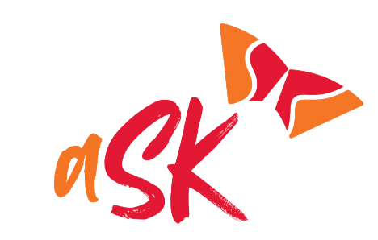
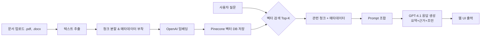

# 글로벌 계약 정보 검색 시스템 'aSK'

<div align="center">



</div>

> **팀명:** 17℃  
> **팀원:** 김준한, 김재민, 문우주, 박민하, 유여은, 주민경

<br>

## 📌 프로젝트 개요

본 프로젝트는 대용량 계약서에서 법률·계약 관련 조항을 **RAG(Retrieval-Augmented Generation)** 기반으로 빠르고 정확하게 검색·검토할 수 있는 AI 법무지원 시스템입니다.

시스템 명칭 **aSK**는 **A**ugmented **S**earch for **K**nowledge을 뜻하며, 단순 키워드 검색이 아닌 임베딩+벡터 검색+LLM 분석을 통한 고품질 답변을 제공합니다.

<br>

## ❗ 배경 및 문제 정의

-   대규모 계약서(수백 페이지)에서 특정 조항 열람에 과도한 시간 소요
-   비전문가 계약 검토 시 주요 조항 누락·해석 오류가 발생
-   기존 LLM 질의응답의 **Hallucination** 문제로 답변의 신뢰성 저하
-   기존 사내 챗봇에 여러 문서 업로드 하지 못함

<br>

## 💡 해결 방안

-   **RAG(Retrieval-Augmented Generation)** 기반 검색을 적용하여 정확도를 높임
-   **근거(원문+페이지)**를 반드시 포함하는 구조화된 답변을 생성
-   OpenAI 임베딩 모델과 Pinecone 벡터 DB를 통해 고정밀 의미 기반 검색을 구현
-   최신 법령 데이터베이스와 자동으로 비교하고 검토
-   다양한 문서 포맷(PDF, DOCX, TXT) 입력 및 다국어(한국어/영어) 출력을 지원

<br>

## 🛠️ 주요 기능

1.  **계약서 검색**
    -   자연어 질의에 대해 관련 조항 및 원문을 페이지 번호와 함께 표시합니다.
    -   법규·정책 데이터와 비교하여 상충 여부를 자동으로 제시합니다.
    -   답변 근거가 부족할 경우, '정보 없음'으로 안내하여 Hallucination을 방지합니다.
2.  **계약서 비교**
    -   두 개의 계약서 문서를 비교하여 조항의 차이점을 하이라이트합니다.
    -   표준 계약서 대비 필수 조항의 누락 여부를 탐지합니다.
3.  **실무 조언**
    -   변호사 관점의 계약 수정안 및 대응 전략을 제시합니다.
    -   모든 조언은 반드시 근거 조항을 포함하여 신뢰성을 확보합니다.
4.  **다국어 대응**
    -   사용자 요청에 따라 한국어 또는 영어로 결과를 제공합니다.
5.  **이력 관리**
    -   모든 검색 및 검토 이력을 기록합니다.
    -   이전 계약 검토 내역을 저장하고 언제든지 다시 조회할 수 있습니다.

<br>

## ⚙️ 기술 스택

-   **언어·백엔드**: `Python 3.10+`, `Flask`
-   **AI / NLP**: OpenAI `GPT-4.1`, `text-embedding-3-large`
-   **벡터 검색**: `Pinecone` Vector DB
-   **데이터 처리**: `LangChain`, `PyPDF`, `python-docx`
-   **검색 평가 지표**: `NDCG@K` (프로토타입에서 0.866 성능 달성)
-   **프롬프트 구조화**: System Prompt + Few-shot Template

<br>

## 📊 시스템 아키텍처



<br>

## 📂 폴더 구조 예시

```text

├── README.md
├── backend
│   ├── data
│   │   ├── GAS SALE AND PURCHASE AGREEMENT.pdf
│   │   ├── JOINT OPERATING AGREEMENT.pdf
│   │   ├── MODEL PRODUCTION SHARING AGREEMENT.pdf
│   │   ├── PURCHASE AND SALE AGREEMENT.pdf
│   │   ├── TECHNICAL SERVICES AGREEMENT.pdf
│   │   ├── ground_truth.xlsx
│   │   ├── model_truth.xlsx
│   │   ├── ndcg_binary_match.xlsx
│   │   ├── system_prompt.txt
│   │   ├── ~$ground_truth.xlsx
│   │   └── ~$model_truth.xlsx
│   ├── main.py
│   ├── ndcg_eval.py
│   ├── output
│   │     ├──
│   ├── rag.py
│   ├── test_contract_termination_to_xlsx.py
│   └── venv
│       ├── Include
│       ├── Lib
│       ├── Scripts
│       └── pyvenv.cfg
├── frontend
│   ├── README.md
│   ├── package-lock.json
│   ├── package.json
│   ├── public
│   │   ├── favicon.ico
│   │   ├── index.html
│   │   ├── logo192.png
│   │   ├── logo512.png
│   │   ├── manifest.json
│   │   └── robots.txt
│   ├── src
│   │   ├── App.css
│   │   ├── App.test.tsx
│   │   ├── App.tsx
│   │   ├── MainPage.css
│   │   ├── MainPage.tsx
│   │   ├── SearchPage.css
│   │   ├── SearchPage.tsx
│   │   ├── assets
│   │   ├── index.css
│   │   ├── index.tsx
│   │   ├── logo.svg
│   │   ├── react-app-env.d.ts
│   │   ├── reportWebVitals.ts
│   │   ├── setupTests.ts
│   │   ├── types.ts
│   │   └── useIntersectionObserver.ts
│   └── tsconfig.json
└── uvicorn
```

<br>

## 🔧 설치 및 실행 방법

#### 1. 환경 설정

```bash
# 1. 레포지토리 클론
git clone [https://github.com/your-repo/rag-law-assistant.git](https://github.com/your-repo/rag-law-assistant.git)

# 2. 폴더로 이동
cd rag-law-assistant

# 3. 가상환경 생성 및 활성화
python -m venv .venv
source .venv/bin/activate  # Windows: .venv\Scripts\activate
```

#### 2. 패키지 설치

```bash
pip install -r requirements.txt
```

#### 3. 환경 변수 설정

루트 디렉토리에 `.env` 파일을 생성한 후, 아래 정보를 입력합니다.

```text
OPENAI_API_KEY=your_openai_api_key
PINECONE_API_KEY=your_pinecone_api_key
PINECONE_ENVIRONMENT=your_pinecone_env
```

#### 4. 실행

```bash
flask run
```

실행 후, 웹 브라우저에서 `http://127.0.0.1:5000` 주소로 접속합니다.

<br>


## 📈 성능

-   테스트 질의 30개 기준 **NDCG@K = 0.866** 달성
-   단순 키워드 검색 대비 평균 검색 정확도 **+28%** 향상
-   답변의 **Hallucination 발생률을 최소화**하고, 주요 조항 누락을 방지

<br>

## 💼 기대 효과

-   **검토 속도 단축**: 수백 페이지 분량의 계약서를 수초 내에 검색 가능
-   **정확한 근거 제공**: 모든 답변에 근거 조항을 제시하여 법률 리스크 최소화
-   **업무 장벽 완화**: 법률 비전문가도 계약서의 핵심 내용을 쉽게 검토 가능
-   **변경 추적 용이성**: 계약서 비교·분석 기능으로 버전 간 변경사항 추적 용이성 향상

<br>

## 📌 향후 개선 방향

-   OCR(광학 문자 인식) 모듈을 탑재하여 스캔된 이미지 형태의 계약서 지원
-   다국어 계약서를 동시에 검색하고 비교하는 기능 추가
-   자동 번역 및 현지 법령과의 비교 기능 고도화
